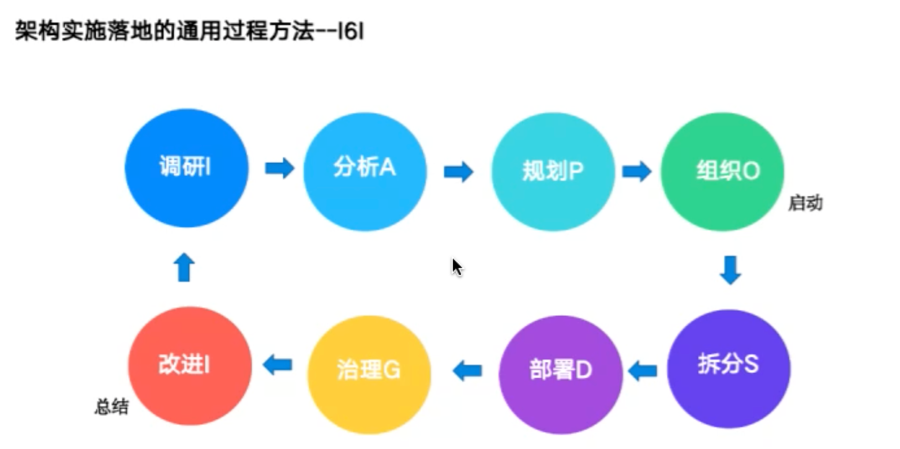

# 架构-非功能

[toc]

## 一、简介

上节课讲了解决方案。

## 二、差异分析

拆分对比。

最重要的一步是基线分析。

基线怎么来：

- 优先级

## 三、示例：微服务改造

第一步：对现状进行梳理；

- 数据库，主从延迟比较高；

解决方案：

- 

## 四、架构三板斧

1. 拆分问题

2. 解决小问题

   问题谁解决不重要，重要的是所有问题，都找到解决办法

3. 组装问题

RMI：Relationshop Mapping Inverse

